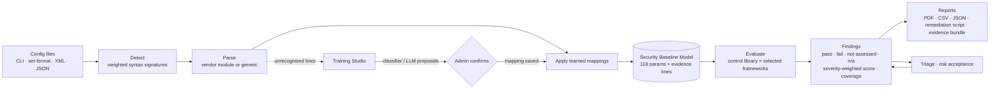
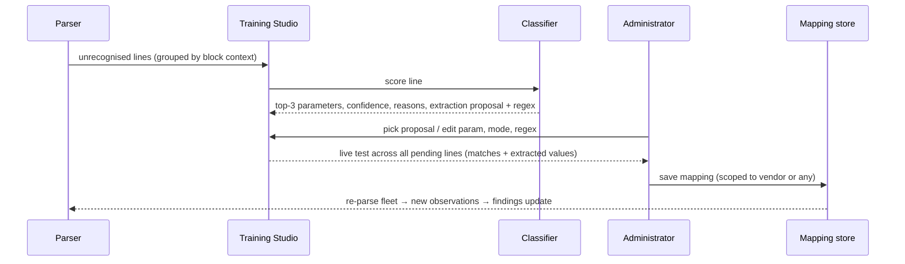

# NetSentinel AI — Architecture (SIH26155)

## 1. Design goal

A compliance engine that does not depend on a hard-coded library of vendor commands. Everything that varies by vendor, framework or organisation is **data** that can be loaded at runtime: vendor signatures, learned syntax mappings, control definitions, framework references and remediation templates. The evaluation core never changes when a vendor ships new firmware. Every number the UI shows is reproducible from the uploaded text, and the engine says "not assessed" whenever it lacks evidence instead of guessing.

## 2. Pipeline

1. **Ingest** (`store.ts`). Files, folders, ZIP archives or pasted text. Each file is SHA-256 hashed; identical content is skipped, and a file whose hostname matches a device already in the fleet replaces it as a new version while the previous version is archived (up to five) for drift analysis.
2. **Detect** (`detect.ts`). Each vendor has regex signatures with weights and human-readable reasons. Score = sum of matched weights; confidence = top / (top + runner-up). Below the threshold the file goes to the generic parser with confidence 0. XML PAN-OS exports are converted to set-format; JSON/XML inputs are flattened into key paths.
3. **Parse** (`parsers/*`). Structure-aware parsers: indentation trees (IOS, IOS-XE, NX-OS, EOS, VRP), brace flattening to `set` paths (Junos, including `groups`, `inactive:` and `deactivate`), `config/edit/set/next/end` stacks (FortiOS, VDOM-aware), path lines (PAN-OS), menu/`set key=value` (RouterOS). Each parser marks every line it understood; anything else becomes an *unrecognised line* with its block context. Parsers also record **platform defaults** (e.g. IOS runs CDP unless `no cdp run`) as low-priority observations, so the absence of a command is evaluated correctly — and never as evidence on a device the parser did not understand.
4. **Learned mappings** (`mappings.ts`). Regex rules taught in the Training Studio run over unrecognised lines. Value modes: *polarity* (enable/disable words → boolean, double negatives handled), *capture* (regex group → number/string), *list*, *count*, *flag*, *const*.
5. **Security Baseline Model** (`sbm.ts`). 118 vendor-neutral parameters in 10 families (management plane, AAA, logging, time, SNMP, services, routing, access control, cryptography, identity). Every observation stores its value, evidence `{line, text}` and source (`parser | default | mapping | llm`).
6. **Evaluate** (`rules/evaluate.ts`, `fleet.ts`). The library holds 68 controls; a control is `{check, severity, refs, remediation}`; checks are conditions over SBM parameters (`eq, gte, lte, in, includes, countGte, regex, exists…`) composable with `all`/`any`. Missing evidence yields *not assessed* rather than a false pass or fail. A device is **assessable** only when at least a quarter of its meaningful lines were recognised and at least three parameters observed (eight for the generic parser); otherwise it is excluded from the fleet score and cannot fail absence checks. Score = Σ weight(pass) / Σ weight(pass+fail) with weights critical 10, high 6, medium 3, low 1; **coverage** = assessed / applicable controls. Risk acceptances (`exceptions.ts`) are keyed by hostname and control id so they survive re-uploads; the **adjusted score** excludes actively accepted failures.
7. **Remediation** (`rules/remediation.ts`). Templates per vendor family with `{{placeholders}}` (syslog host, NTP servers, management subnet in CIDR/wildcard/mask forms, banner…), `{{#each list}}` loops over observed values (one `no snmp-server community X` per offending community, one `neighbor X password` per unauthenticated peer) and `{{#if}}` branches on the device state (AAA present or not, IOS-XE vs classic IOS), so the CLI is specific to the audited device. Vendors without a template borrow their family's (NX-OS → IOS).
8. **Drift** (`diff.ts`). LCS line diff between versions plus the semantic delta of the normalised model (parameters added/removed/changed) and of the findings (regressed / fixed / changed).
9. **Report** (`report/*`). jsPDF + AutoTable device report: score strip, identification (hostname, vendor/OS, version, model, serial, management IP, SHA-256 of the configuration, parser coverage), findings table with framework references, remediation paths with evidence and CLI, accepted risks, the normalised model. Fleet summary PDF; CSV and JSON for SIEM/GRC ingestion; a per-device remediation script wrapped in review comments; a ZIP evidence bundle with `MANIFEST.json` / `MANIFEST.sha256` digests of every artefact.

## 3. The training loop (dynamic adaptation)

**Classifier** (`classifier.ts`), fully offline: tokenises with punctuation, hyphen and letter/digit splitting (`ssh2 → ssh, 2`), scores each SBM parameter by keyword/phrase overlap (multi-word phrases and exact substrings weigh more; generic words are down-weighted), adds nearest-neighbour Jaccard similarity to a 212-command cross-vendor corpus and to mappings already learned, then squashes the score into a confidence with a margin penalty when the runner-up is close. It proposes the extraction mode from the line's shape (polarity word, number, IP address, quoted string). **LLM assist** (optional, operator's own Anthropic key, session-scoped) returns JSON proposals for a batch of lines; they are shown beside the classifier's and never applied without confirmation.

Mappings persist in the browser, can be edited or removed (with undo), and are portable as **mapping packs** (JSON). The EXOS starter pack demonstrates that a vendor unknown to the code base becomes fully auditable by loading data.

## 4. Extensibility matrix

| To add… | Change |
|---|---|
| a vendor with simple syntax | none — teach mappings in the Studio, export the pack |
| a vendor with deep hierarchy | one parser module + one signature block |
| a framework | add `refs` on existing controls (and severity overrides if needed) |
| a control | one object in the library, or the low-code form in the UI |
| an organisation standard (e.g. 5-minute timeout) | custom control from the UI |
| remediation for a new OS | one template string per control |
| a risk decision | accept the finding with reason, expiry and ticket; it is printed in the report |

## 5. User interface

The UI is an "instrument of record": a paper-light ground with an ink/serif/monospace type system, hairline sections instead of card grids, status colour reserved for verdicts (pass, fail, not assessed, N/A, accepted), and a dark twin. Every table sorts, long lists paginate, every row is keyboard reachable, drawers and dialogs trap focus, destructive actions require a second click and offer undo, and the whole app works at phone width with a bottom navigation bar. A command palette (Ctrl+K) jumps to any page, device or control. A Methodology page explains the scoring, assessability and the training loop in the product itself.

## 6. Technology

React 19 + TypeScript + Vite; Zustand with quota-safe local-storage persistence (versioned, secrets never persisted); jsPDF + AutoTable; JSZip for bulk archives and evidence bundles; WebCrypto SHA-256 with a pure-JS fallback; Vitest over detection, every parser, the classifier, mapping application, evaluation, remediation rendering, drift, exceptions and the store. Deployable as a static site (GitHub Pages workflow included) or as a single HTML file.

## 7. Operating model and future work

The prototype runs entirely client-side to guarantee that sensitive configurations never leave the analyst's workstation — appropriate for NCIIPC-class environments. The same engine (pure TypeScript, no DOM dependencies) can run in a Node service for scheduled collection with Netmiko/NAPALM over SSH, a shared mapping-pack registry, and ledger-anchored signed evidence bundles.
